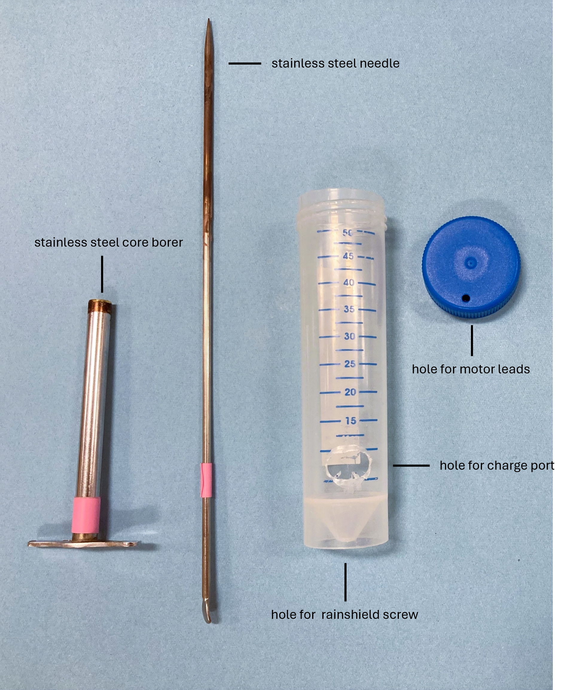
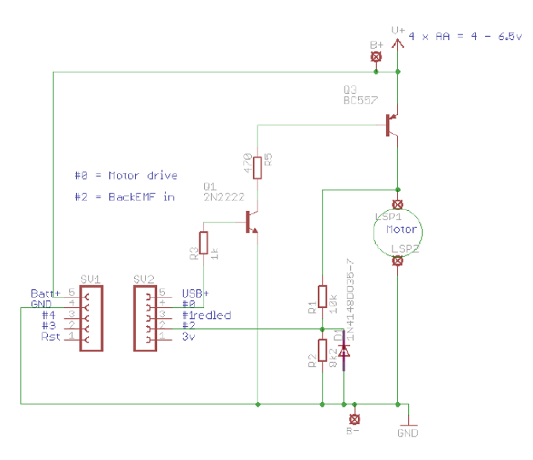
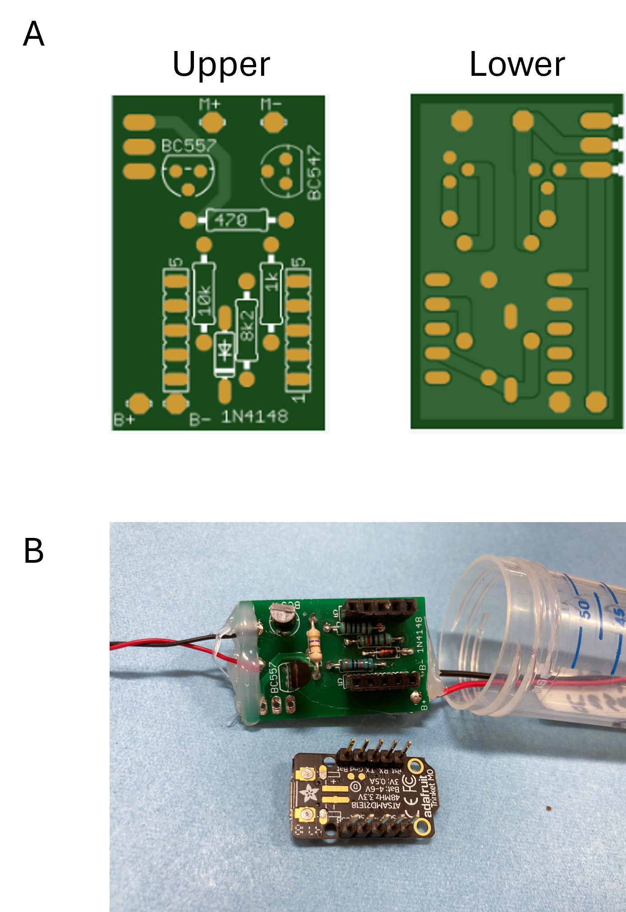
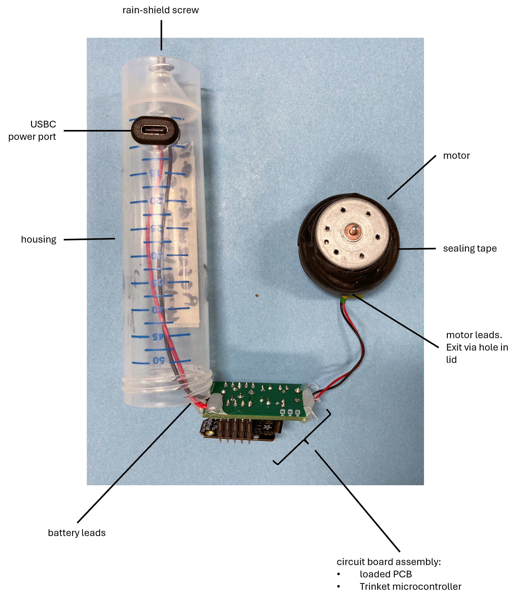
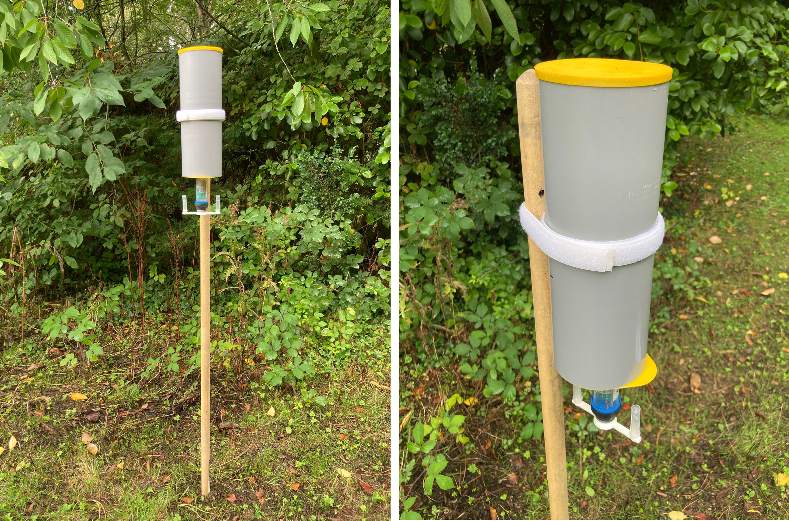

This page provides instructions on AberTrap assembly.

# 1. **Housing**

- Adapt the 50ml centrifuge tube to accommodate the AberTrap's wiring:
  - Make a hole in the tube lid for the motor cable, using either a hot 2 mm stainless steel needle, or drill. Make sure that the hole is inset enough that the motor leads will not be pinched in the screwthread when the lid is put back on.
  - Make an approx 15 mm oblong hole at the base of the tube for the power port to sit in (Figure s1), using either a hot 7 mm diameter core borer, or 7 mm drill bit.

*Figure s1 Modifying the AberTrap housing (50ml falcon) to accommodate wiring*

# 2. **Circuitry**

Assemble the AberTrap components as per the circuit diagram (Figure s2), in the following order:

1. **Circuit board assembly**. Use the layout printed on the PCB (Figure s3) to populate the PCB with [the components](AberTrap_device_parts_list.csv). Solder components into place on the underside of the board. Its easiest to add a few components first, solder these, clip off the spare [legs] then add a few more.
   *note* Ensure the correct orientation of the diode [part num] and transistors [part num], as indicted on the PCB.

    - **Microcontroller.** Solder pin headers onto the Trinket. When mounting the Trinket onto the pin sockets (soldered onto the PCB), ensure the correct orientation of pins; the text “Trinket M0” should be oriented towards the battery connection points, with the microUSB aligning with the mouth of the centrifuge tube (Figure s3B). See [this page](https://learn.adafruit.com/adafruit-trinket-m0-circuitpython-arduino/pinouts) for explanation of the Trinket pins.

3. **Motor.** Insert the motor leads through the newly made hole in the lid of the centrifuge tube. Secure the motor to the lid by first affixing into a small blob of hot glue, into which the motor is pressed. Then secure the motor in place by wrapping the motor and lid with self-amalgamating tape (Figure s4). Solder the motor leads onto to the PCB as indicated at the “M+” (red lead) and “M-“ (black lead) connection points. 

4. **Power.** Inset the USBC power port into the newly made hole in the body of the centrifuge tube (Figure s1). Connect the leads of the port to the PCB as indicated at the “B+” (red lead) and “B-" (black lead) connection points (Figure s3A). Add a blob of hot glue to both the motor and power connection points for extra strength

5. Push the finished circuit board assembly into the adapted centrifuge tube. A twisting motion helps coil the leads to the bottom of the tube, allowing the PCB to fit. Screw on the lid, making sure that the motor leads are not pinched in the screwthread. 

The assembled AberTrap (Figure s4) is now ready for programming.

---

*Figure s2 AberTrap circuit diagram*

---

*Figure s3 A) Layout of the PCB showing positioning of each of the circuit components B) Photograph of a complete circuit board assembly, including Trinket microcontroller, power and motor leads*

---

*Figure s4 labelled photograph of an assembled AberTrap*

---

# 3. **Arms**
Rotating arms are printed from 0.75mm TPU (95a shore hardness). Print files are available in the [Assembly_files](Assembly_files). Each arm can be reused several times; for metabarcoding we recommend washing and sterilising arms between each use. 

# 4. **Battery Enclosure**
When deployed outdoors such as woodland or grassland, the AberTraps should be mounted at a fixed height from the ground. This can be achieved by sticking a wooden pole in the ground. eg Broom handle. Height= 1500 mm, diameter= 28 mm. 

The AberTrap can be mounted onto this pole in a waterproof enclosure holding the battery and cabling. This enclosure is made from 100mm (internal diameter) plastic pipe, cut into lengths. Files for 3D printing flexible upper and lower end caps from 95a TPU are provided in the [Assembly_files](Assembly_files). The lower cap has an offset hole through which the AberTrap can be pushed, allowing the USBC port and battery to be hidden from rain. Use velcro strapping to attach the enclosure to the pole.    

*Figure s5 Battery enclosure for outdoor operation* 
